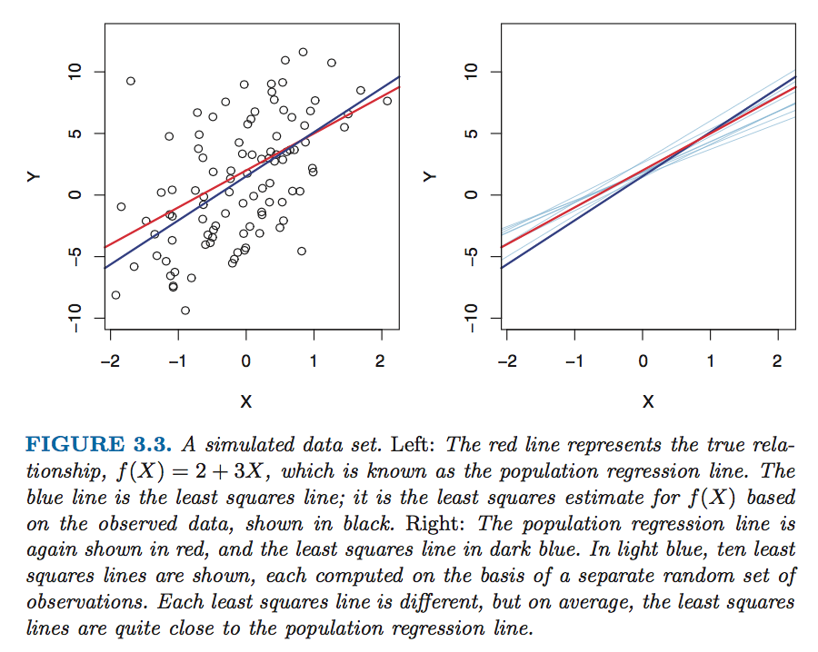

**Table of Content**

Introduction

* Assumptions of linear regression
* Fitting a straight line
* Simple Linear Regression Model
* Linearizing Transformations

Model Building Procedure

1. Univariate exploration of the data
    * Check missing values
    * Check the distribution of each variable
2. Bivariate exploration of the data
3. Interactions
4. Traning set and test set
5. Fit several candidate models
    * Ridge Regression
    * Lasso Regression
    * Comparasion and geometrical explanation for Ridge and Lasso
    * Stepwise Regression
        *  Forward stepwise, Backword stepwise, Forward selection, Backword selection
        *  using Partial Correlation Coefficient to do stepwise regression
        *  using AIC to do stepwise regression
6. Comapre the candidate models
    * Some Criterions
        *  R-square
        *  R-adjusted-square
        *  Cp statistics
        *  AIC
        *  BIC
    * Model Diagnostics
        *  Checking Normality
        *  Checking Homoscedasticity
        *  Checking Independence
        *  Checking Outliers
        *  Checking Influential Observations
            *  Leverage
            *  Cook's distance
        *  Checking Multicollinearity: VIF (>10)
7. Selection of final model

Other terms

* Degree of freedom
* Random variable
* Dummy Variable

Some other topics

---

## Introduction
Let's begin with a sample example. Suppose we are consultant hired by an company to provide advice on how to imporve sales of a particular product. The attributes of the data we have is sales of the product, country, media with different types such as TV, online adverting, newspaper, and advertising budget.

How can linear regression analysis help us on this case? Here are some of the questions that can be answered using linear regression.
* Is there a relationship between advertising budget and sales?
* How strong is the relationship betwwen advertising budget and sales?
* Which media contribute to sales?
* How accurately can we estimate the effect of each medium on sales?
* How accurately can we predict future sales?
* Is the relationship linear?
* Is there synergy among the advertising media?

## Assumptions of linear regression
Before we start building the model, there are several assumption underlie the regression model

1. **Linearity**: There is a linear relationship between predictors and the dependent variable.
2. **Normality**: The random errors $\varepsilon_i$ are normally distributed.
3. **Constant Variance(a.k.a. homoscedasticity)**: This means that different values of the response variable have the same variance in their errors, regardless of the values of the predictor variables. No auto-correlation. The $\varepsilon_i$ have a constant variance $\alpha^2$.
4. **Independence**: This assumes that the errors of the response variables are uncorrelated with each other., ie, no or little multicollinearity. The $\varepsilon_i$ are statistically independent.
5. ??

## Fitting a straight line
Let's consider the problem of fitting a straight line 
$$y=\beta_0+\beta_1x$$

The **least squares(LS) method** is commonly used to estimate them. The **LS estimators** of $\beta_0$ and $\beta_1$, denoted by $\hat{\beta_0}$ and $\hat{\beta_1}$, minimize the sum of the squared differences between the observed $y_i$'s and their predicted values

$$ Q= \displaystyle\sum_{i=1}^{n} \big[y_i - (\beta_0+\beta_1x_i)^2 \big]  $$
$Q$ is our cost function in this case. We will try to find $\hat{\beta_0}$ and $\hat{\beta_1}$ that help us minimize $Q$. It can be easily achieve by setting partial derivatives $\frac{\partial Q}{\partial \beta_0}$ and $\frac{\partial Q}{\partial \beta_1}$ equal to 0 and then solve the equations.

We refer to our **LS line** as
$$\hat{y}=\hat{\beta_0}+\hat{\beta_1}x$$
where $\hat{y}$ is the predicted value of $y$. From the formula of $\hat{\beta_0}$, we can also see that the line pass through the midpoint ($\bar{x}, \bar{y}$) of the scatterplot.

## Simple Linear Regression Model
The standard normal theory model for simple linear regression is 

$$y_i = \beta_0 + \beta_1x_i+\varepsilon_i \quad (i=1,...,n)$$

which $\beta_0$ and $\beta_1$ is the "true" relationship between $X$ and $Y$. $X$ is assumed to be nonrandom. 

In a regression model, the predictor variables, in this case we have only 1 $x$, are assumed to be fixed and known. They are not assumed to be random. We can think of $x$ as some think we can control like in an experiment, i.e., the same value of $x$ can generate different $y$. That's why we see the error terms $\varepsilon_i$'s as random variables. For $\varepsilon_1$'s, it capture the difference between the predicted $y_1$ and actual $y_1$. It is a random variable since even with the same value of $x$, we can get different $y$ because of something we don't know. It maps this randomness into a real number, which is the difference.

Therefore, all of the randomness in the model is assumed to be in the error term. The error terms $\varepsilon_i$ are random variables that capture the difference between ($x_i, y_i$) for all i from $1,...,n$, since it map the underlying difference between each ($x_i, y_i$). The randomness is from calculating the error term using different set of observations, i.e., when we use different set of ($x_1, y_1$), the LS estimator will be different, hence our $\varepsilon_1$ will be different. We can fully write the random variable $\varepsilon_1$ for the difference between ($x_1, y_1$) as 
$$\varepsilon_1 = \big[y_1 - (\beta_0 + \beta_1x_1)\big] $$
where $\beta_0$ and $\beta_1$ is the true relationship that we do not know.
The actual residual can be write as following:

$$ e_1 = \big[y_1 - (\hat{\beta_0} + \hat{\beta_1}x_1)\big]  $$
where $\hat{\beta_0}$ and $\hat{\beta_1}$ can be different values depending on the sample of datasets we calculate it.

As a result of the error terms, $y_i$ are random variables as well.

Since $\varepsilon_i$'s are assumed to be independent and identically distributed(i.i.d.) with $N(0, \alpha^2)$. It follows that the $y_i$'s are i.i.d. as well wtih 
$$ E(y_i) = \mu_i = \beta_0+\beta_1x_i \quad \text{and}\quad Var(y_i)=\alpha^2 \quad \text{(i=1,...,n)}$$

The picture above clearly explain why LS estimators are random variables with variance and expected values. The reason behind it is that we can take different sets of oberservations to get the LS estimators, and each time the LS estimator will be different. Quoted from the ISLR book: "The property of *unbiasedness* holds for the least squares coefficient estimates, it means that: if we estimate $\beta_0$ and $\beta_1$ on the basis of a particular data set, then our estimates won't be exactly equal to $\beta_0$ and $\beta_1$. But if we could average the estimates obtained over a huge number of data sets, then the average of these estimates would be spot on".

Another way to explain why LS estimators are random variables is that since $y_i$'s are random variables($y_i$ are  functions of $\varepsilon_i$'s, and $\varepsilon_i$'s are random variable), and $\beta_0$ and $\beta_1$ are functions of $y_i$'s. Therefore, LS estimators are random variables.

## Linearizing Transformations

**Case 1**: 

If we suspect that the relationship between $x$ and $y$ is in power law, that is 
$$ y=a x^{b} $$
We can make it into a linear regression problem by taking the log transformation. The log-transformed equation is $$ ln(y) = ln(a)+b ln(x) $$

which is a straight line on the log-log scale, so the model is called **log-log model**. By making transformation $y-> ln(y)$ and $x-> ln(x)$, we get a straight line wiht intercept $\beta_0=ln(a)$ and slope $\beta_1=b$.

**Case 2**: 

If we suscept that the relationship between $x$ and $y$ is exponential, which can be negatively curved (the power of exp below 0) or positively curved (the power of exp over 0), that is 
$$ y=a e^{b x} $$
We can make it into a linear regression problem by taking the log transformation. The log-transformed equation is $$ ln(y) = ln(a)+b x $$

which is a straight line on the log of $y$ scale, so the model is called **log model**. By making transformation $y-> ln(y)$, we get a straight line wiht intercept $\beta_0=ln(\alpha)$ and slope $\beta_1=b$.

--- 

# Model Building Procedure
Here are the suggested steps from the textbook "Predictive Analytics: Paramertic Models for Regression and Classificantion" to take when building up regression models.

> **1. Univariate exploration of the data**

Examine each variable for outliers, missing values, obviously wrong or inconsistent data entries..etc

#### • Check missing values
Replace the missing values with some value or discard the row with missing values if the fraction of the missing values is small. 

#### • Check the distribution of each variable
Examine distributions for all single variablese and in cases of highly skewed distributions make suitable transformations to sysmmetrize the distributions. 

> **2. Bivariate exploration of the data**

Make scatter plots and compute correlations between all variables to identify any multicollinearities. When the number of the predictors is large, then it is not recommend to make transformation on $y$ unless the transformation works on all $x$'s or a subject matter based transformation exists for $y$ .

> **3. Interactions**

Recommend including only those interactions taht are supported by someone with domain knowhow.

> **4. Traning set and test set**

Divide the dataset into training and testing dataset.

> **5. Fit several candidate models**

#### • Ridge Regression

Ridge regression is very similar to least squares, except that the coefficients are estimated by minimizing a slightly different quantity. We add a *shrinkage penalty* to our cost function $Q$, which is the $L2$ norm of the coefficient. The ridge estimator of $\beta$ is defined as follows:
$$ minimize_{\beta} \Big(Q  \Big) \quad \text{subject to } \displaystyle\sum_{i=1}^{n} \beta_j^2 \leq d^2 $$
where $Q$ is the LS criterion we introduced previously. 

We can think of the constant $d^2$ as a budget for how large $\displaystyle\sum_{i=1}^{n} \beta_j^2$ can be. If $d^2$ is extremely large, then this budget is not very restrictive, and so the coefficient estimates can be large, which is actually the same as LS estimators. In contrast, if s is small, then the budget will constraint the coefficient to become small. 

#### • Lasso Regression

For lasso regression, we also add a *shrinkage penalty* to our cost function $Q$. Instead of adding $L2$ norm, we add $L1$ norm of the coefficient. The lasso estimator of $\beta$ is defined as follows:

$$ minimize_{\beta} \Big(Q  \Big) \quad \text{subject to } \displaystyle\sum_{i=1}^{n} |\beta_j| \leq d^2 $$

where $Q$ is the LS criterion we introduced previously. 

#### • Comparasion and geometrical explanation for Ridge and Lasso

If we plot the LS criterion in the 2 dimensional $\beta$ space, The contours for constant values of the criterion are ellipses. The center of the ellipse is where the LS criterion is minimum and corresponds to the LS estimator $\hat{\beta}$. If $s$ is sufficiently large, then the result of ridge and lasso estimators will be the same as LS estimator. By adding the $L1$ and $L2$ penalty to the criterion/cost function, the lasso and ridge regression coefficient estimates are given by the first point at which an ellipse contacts the constraint region. 

Since ridge regression has a circular constraint with no sharp points, the intersection will not generally occur on an axis, and so the ridge regression coefficient estimates will usually be non-zero. In contrast, the lasso constraint has corners at each of the axis, so the ellipse will often intersect the constraint area at an axis. When this occurs, one of the coefficients will be zero.

* **The advantage of lasso over ridge**

    * The $L1$ penalty has the effect of forcing some of the coefficient estimates to be exactly equal to zero when the tuning parameter *labmda* is sufficiently large. In other words, lasso performs *variable selection*. In contrast, Ridge regression, unlike best subset, forward/backward stepwise regression, will include all p predictors in the final model. The penalty will shrink all of the coefficients towards zero, but it will not set any of them exactly to zero, unless $\lambda$ is very large.
  
    * In general, we might expect the lasso to perform better in a setting where a relatively small number of predictors have substantial coefficients, and ridge regression will perform better when the response is a function of many predictors, all with coefficients of roughly equal size. However, the number of predictors that is related to the response is never known before the model is being fitted. Therefore, we usually use cross-validation to compare between ridge and lasso.

  
* **The advantage of lasso and ridge over LS estimators**

    * Tbe advantage is rooted in the *bias-variance trade-off*. When $\lambda$ increase, the bias will increase but the variance will decrease, and it will lower than the variance calculated using LS estimators.

#### • Stepwise Regression
####    --- Forward stepwise, Backword stepwise, Forward selection, Backword selection
####    --- using Partial Correlation Coefficient to do stepwise regression
####    --- using AIC to do stepwise regression

> **6. Comapre the candidate models**

#### Some Criterions

There are many criterions to check whether the candidate models is ideal or not. Below are some of them:

#### • R-square

We can rewrite the deviation of each $y_i$ around $\bar{y}$ as the sum of two parts:
$$ y_i-\bar{y}= (y_i-\hat{y_i}) + (\hat{y_i}-\bar{y}) = (y_i-\hat{y_i}) + e_i  $$
By summing everything observation up, we can then get the **analysis of variance(ANOVA) identity**

$$ \displaystyle\sum_{i=1}^{n} (y_i-\bar{y})^2 = \displaystyle\sum_{i=1}^{n} (y_i-\hat{y_i})^2 + \displaystyle\sum_{i=1}^{n} (e_i)^2 $$
which can be represent as 
$$SST=SSR+SSE  $$

* SST: total sum of squares
* SSR: Regression sum of squares. It represent the part of the total variation of the $y_i$'s that is accounted for by regression of the $y_i$'s on the $x_i$'s.
* SSE: Error sum of squares

#### • R-adjusted-square

R-sqaured can be increased to 100% in the limit by adding more and more predictors to the model. It will then be a problem of overfitting. Therefore, adjusted R-squared is often used as a measure of the goodness of fit. It is defined as
$$ R_{adj}^2 = 1 - \frac{SSE/(n-(p+1))}{SST/(n-1)}$$
We can see that as $p$ increases, $SSE/(n-(p+1))$ will become larger, which makes $R_{adj}^2$ become smaller.

#### • Cp statistics

$$ C_p = \frac{SSE_p}{\hat{\alpha}^2}+ 2(p+1)-n$$
where $n$ is the number of observations; $p$ is the number of predictors; $SSE_p$ is the sum of square errors generated by this particular model; $\hat{\alpha}^2$ is the $MSE$ of the model, which is $\frac{SSE}{n-(p+1)}$
The smaller the $C_p$ of the model is, the better. It put some penalty on the number of predictors.

#### • AIC

$$ AIC_p  = n\ln(SSE_p/n)+2(p+1) $$
where $n$ is the number of observations; $p$ is the number of predictors; $SSE_p$ is the sum of square errors generated by this particular model. 
Compared to $C_p$ statistics, it put more weight on the number of predictors than $SSE_p$, so when we use $AIC$ criterion to choose our final model, the number of predictor tend to be less than $C_p$. In other words, $AIC$ tends to choose a more parsimonious model than does $C_p$.

#### • BIC

$$BIC_p  = n\ln(SSE_p/n)+(p+1)\ln(n)$$ 
$BIC$ put more penalty on the number of predictors than $AIC$, since $\ln(n)$ way higher than $2$. Therefore, when we use $BIC$ criterion to choose our final model, the number of predictor will be even less than $AIC$. $BIC$ results in a smaller model than $AIC$.

#### Model Diagnostics

#### • Checking Normality
**QQ plot**
QQ plot is a plot of the quantiles of the resuduals versus theoretical standard normal distribution quantiles. It can help us see whether the $\varepsilon_i$ is right-skewed, long-tailed, short-tailed, ..etc.

#### • Checking Homoscedasticity
**Fitted value plot **
If the variance of the error term is not constant, then the inference on the LS estimators will be invalid since in the derivation of the variance of $\beta_0$ and $\beta_1$, we have used this property to get our final result. If it is violated, then the infernce will be invalid. Also, our test statistics to testing whether $\beta_1=0$ uses the standard error of $\beta_1$ as well, which is derived using constant variance property, will incorrectly use a common pooled MSE as an estimate of the error variance of $\beta_1$. In short, violance in it will result in less precise parameter estimates and misleading inferential quantities such as standard errors.

We can check the homoscedasticity by putting $\hat{y_i}$ on x and residuals $e_i$ on y to see whether there is any relationship between these two variables.

#### • Checking Independence
**Run's test**
We use the number of "runs" in the residual sequence to decide whether if the residual is independent with each other or not. "Runs" is defined as the number of sign changes in the sequence. If there is positive correlation between each residual, then there will be too few runs; if there is a negative correlation between each residual, then there will be too many runs resulting in a zig-zag pattern since each resudual will tend to be followed by an opposite signed residual.

For example, if the sequence is [+,+,-,-,-,+,+], then the run is 3. In this case, we say that 
$R$=3, which is the number of runs. 
$n_1$=4, which is the number of + signs 
$n_2$=3, which is the number of - signs 

If $n_1+n_2$ is large, then by Central limit theorem, we can use the following statistics to test whether if the residuals are independent with each other.

$$z= \frac{R-E(R)}{\sqrt{Var(R)}}$$
where 

$$ E(R)=\frac{2n_1n_2}{n}+1 \quad \text{and} \quad  Var(R)=\frac{2n_1n_2(2n_1n_2-n)}{n^2(n-1)} $$

\[ 
  \begin{cases}
    \phi>0  & \quad \text{if } z<-z_{\alpha} \\
    \phi<0  & \quad \text{if } z>z_{\alpha} 
  \end{cases}
\]

or 

\[ 
  \begin{cases}
    \phi\neq 0  & \quad \text{if } |z|>|z_{\alpha}| \\
  \end{cases}
\]

#### • Checking Outliers
Outliers are observations that deviate significantly form the fitted model, i.e. by more than two or three standard deviations. We can use deleted residual to check outliers. We calculate the difference of the original predicted $y_i$ and the $\hat{y_{i(i)}$, which is the fitted value of $y_i$ after omitting the observation $i$ from the model. Instead of fitting model for each i, we can get the deleted residual $e_{i(i)}$ from the following equation:
$$ e_{i(i)}=\frac{e_i}{1-h_{ii}}$$
A rule of thumbs to check whether the observation $i$ is an outlier is by checking whether this number exceeds 2 or 3.

#### • Checking Influential Observations
#### --- Leverage

We know that $\hat{y}=X(X'X)^{-1}X'y = Hy$ and that $trace(H)=trace[X(X'X)^{-1}X']=trace[X'X(X'X)^{-1}]=trace(I)=p+1$, where p is the number of predictors.

The $i$th fitted value is given by
$$\hat{y_i}=h_{i1}y_i+...+h_{ii}y_i+...+h_{in}y_n $$
which means our $i$th predicted value is a weighted sum of all $y_j$ and h_{ii} is the weight on $y_i$. If $h_{ii}$ is too large then $y_i$ can be said to have too much influence on its own fitted value. We refer to $h_{ii}$ as the **leverage** of the observation.

How large must the leverage be in order for the observation to be regarded influential? Since the mean of the $h$ is $\frac{p+1}{n}$, a rule of thumb is to declare the $i$th observation as influential if $h_{ii}$ exceeds twice this average, i.e., if 
$$h_{ii} > \frac{2(p+1)}{n}$$. Note that since $H$ is calculated using $X$ matrix, leverage identifies those observations as influential that are outliers in the $x$-space.

#### --- Cook's distance

Cook's distance takes the effects of both $x$ and $y$ space when detecting outliers. Cook's distance is defined as following:

$$ D_i = \frac{\displaystyle\sum_{j=1}^{n} (\hat{y_j}-\hat{y_{j(j)}})^2}{s^2(p+1)} = \Big(\frac{e_{i}^*}{\sqrt{p+1}}\Big) \Big(\frac{h_{ii}}{1-h_{ii}}  \Big) $$
We see that $D_i$ combines the outlierness of the $i$th observation in the y-space through the first term; x-space through the second term, which is an increasing function of the leverage $h_{ii}$

A rule of thumb used in practice is to declare the $i$th observation as influential if $D_i>4/(n-p-1)$

#### • Checking Multicollinearity
#### --- VIF (>10)

When there is multicollinearity, it will make most of the entries in covariance matrix become large, thus the variance of each $\beta$ become large. It will then make most of the t-statistics of each $\beta$ become small, whcih makes most of the $\beta$ nonsignificant. In practice, moderate multicollinearity may not be problematic. However, severe multicollinearity is a problem because it can increase the variacne of the coefficient estimates and make the estimates very sensitive to minor changes in the models, that is, when we use different data from the same population to fit the model, the coefficient is prone to change. Therefore, the result is that the coefficient estimates are unstable and difficult to interpret. Multicollinearity saps the statistical power of the analysis, can cause the coefficients to switch signs, and makes it more difficult to specify the correct model.

A typical result of the model with multicollinearity is that most of the coefficient turn out to be statistically nonsignificant, but the overall model can be significant, i.e., the overall R-squared is high and the ANOVA F-statistics can be significant.

The deal with this problem, we can use **Variance Inflation Factors** to check whether there is mnulticollinearity present in the model. 

Let $R_j^2$ denote the $R^2$ from the regression of $x_j$ om all other predictors. Then *VIF_j* is given by

$$ VIF_j = \frac{1}{1-R_j^2}  $$

If $x_j$ is approximately linearly dependent on other predictors then $1-R_j^2$ will be close to 1 and so *VIF_j* will be large.

A common rule of thumb is to declare multicollinearity if most of the *VIF_j* are >10

> **7. Selection of final model**

Make the final selection based on the test $MSE$ of the candidate model using the testing dataset. 

---

### Other terms

#### • Degree of freedom

In statistics, the number of **degrees of freedom(d.f.)** is the number of values in the final calculation of a statistic that are free to vary. The number of independent ways by which a dynamic system can move, without violating any constraint imposed on it, is called *number of degrees of freedom*.

For example, in a simple linear regression model with sample size $n$. The d.f. of residuals, i.e. **error d.f.**, is $n-2$, because the residuals satisfy the following two linear constraints

$$\displaystyle\sum_{i=1}^{n} e_i = 0 \quad and \quad \displaystyle\sum_{i=1}^{n} x_ie_i = 0$$
Both equation can be derived by taking partial derivative of $\beta_0$ and $\beta_1$ from the least square criterion $Q$.

#### • Random variable

A random variable is defined as a function that maps outcomes to numerical quantities (labels), typically real numbers. In other words, a random variable is a variable whose value depends on unknown events. Let's take coin tossing as our example. When we toss a coin, we could get Heads or Tails, and we are not sure whether we will get Heads or Tails each time. If we map the event "Heads" to 1 and "Tails" to 0, then this mapping function can be our random variable, which is:

\[ X =
  \begin{cases}
    0  & \quad \text{if}\quad \text{Heads}\\
    1  & \quad \text{if}\quad \text{Tails}
  \end{cases}
\]

#### • Dummy Variable

When there is categorical variable in some of our features, we can 

### Some other topics

* Extra sum of square method to test whether the new predictors contribute significantly to the model or not
* Dummy variable and its explaination
* Analysis of variance(ANOVA) for simple linear regression
The prupose of the ANOVA is to partition the total variation in the response variable $y$ into independent components so taht each component can be attributed to a separate source of variation. We can use the F-statistics to test whether ifthe coefficient of the model is all 0 or not.

Reference

* https://en.wikipedia.org/wiki/Linear_regression#Assumptions
* https://en.wikipedia.org/wiki/Degrees_of_freedom_(statistics)
* https://stats.stackexchange.com/questions/50/what-is-meant-by-a-random-variable
* https://stats.stackexchange.com/questions/246047/independent-variable-random-variable
* http://onetipperday.sterding.com/2012/05/data-transformation-variance.html
* [An Introduction to Statistical Learning
with Applications in R](http://www-bcf.usc.edu/~gareth/ISL/)
* Predictive Analytics: Paramertic Models for Regression and Classificantion by Ajit C. Tamhane and Edward C. Malthouse

