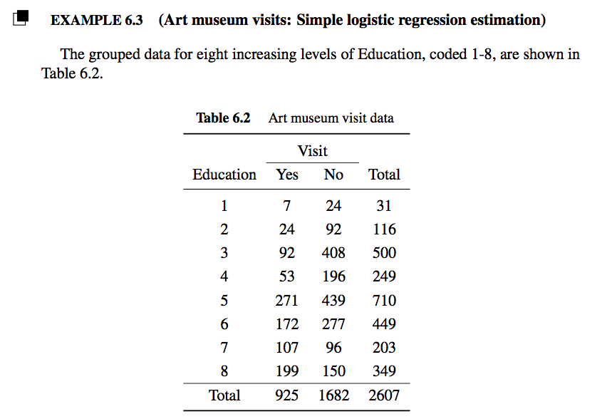
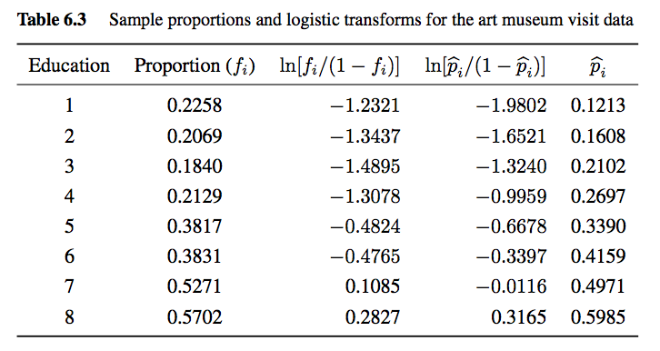
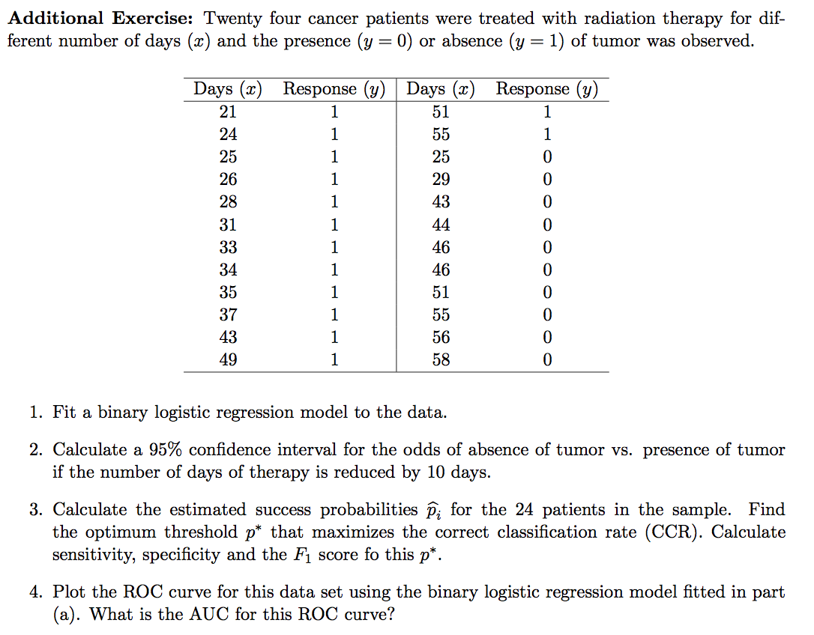
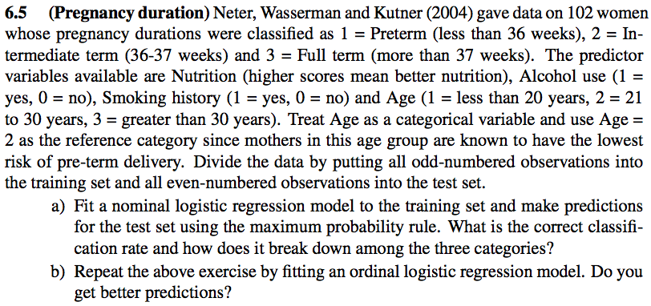

## Table of content

* Logistics Regression
    * The idea behind logistics regression model
    * The interpretaion of $\beta_1$ in logistics regression
    * Estimating the regression coefficients
    * 
* Multinomial Logistics Regression
    * Logistics Regression for Nominal Response
    * Bayes Classification
    * Logistics Regression for Ordinal Response


---

## Logistics Regression

### • The idea behind logistics regression model

Logistic Regression is useful when the outcome of our regression model is categorical.
Instead of using y, which we assume the value of it is categorical like {0,1}, {yes, no}, directly as our response variable, we models the probability that y belongs to a particular category. In other words, we build up a linear model on the log-odds (or logit). In the following paragraph, we denote the probability that y belongs to a particular category as $p(X) = Pr(Y=1|X)$ 

Since $p(X)$ is the probability that y belongs to a particular category, the value of it should be between 0 and 1. Therefore, we must model p(X) using a function that gives outputs between 0 and 1. Many functions meet this description. In logistic regression, we use the logistic function:

$$ p(X)= \frac{e^{\beta_0+\beta_1X}}{1+e^{\beta_0+\beta_1X}}  $$

We can easily see that the output value of this model is within 0 and 1. When $\beta_0+\beta_1X$ goes to $\infty$, $p(X)$ will be 1; When $\beta_0+\beta_1X$ goes to -$\infty$, $p(X)$ will be 0.

This is the model that we are going to use to build up our regression model on. To make the equation to become more interpretable, after a bit of manipulation, we can get the following one:

$$ log(\frac{p(X)}{1-p(X)})= \beta_0+\beta_1X $$

In the left hand side of the equation, it is the log odd of the probability that y belongs to a particular category. For example, if the probability of a success event is 0.8, then the odd ratio will be 4. The higher odds we get, the more likely we will get a success event. 

The left-hand side is called the log-odds or logit, which is also the link function of logistics regression. We see that the logistic regression has a logit that is linear in $X$.

For the illustration purpose, we can see the Example 6.3 from the textbook *Predictive Analytics: Paramertic Models for Regression and Classificantion*

We can see that the model is fitted using the log odd as y and the Eduation level as x. When eduation level increase from 1 to 2, then the log odd of visit is increased by $\beta_1$.





### • The interpretaion of $\beta_1$ in logistics regression

The above equation also equals:

$$ \frac{p(X)}{1-p(X)}= e^{\beta_0+\beta_1X}  $$

Here we assume that the $beta_1$ we get is 0.3. From the above equation, we can see that when $x$ is increased by 1 unit, the odd ratio will increase by $e^{\beta_1}$=`r exp(0.3)`. $\beta_1$ means how much the log odd ratio will increase if our predictor $x$ is increased by 1 unit. In other words, if $x$ is increased by 1 unit, then the odds ratio will increase by $e^{\beta_1}$. We can also get the increased probability of success from the increased odd ratio we get. For example, if the original $p(X)$ is 0.8, then our odds ratio is 4. When we increased x by 1, the odds ratio increased by $e^{\beta_1}$=`r exp(0.3)`. Therefore, the increased odd ratio is `r 4*exp(0.3)`. We can then get that our increased $p(X)$ is `r 4*exp(0.3)/(1+4*exp(0.3))`. 

### • Estimating the regression coefficients

***Why can't we use least square method to estimate the coefficient for logistic regression?***

***What is Maximum Likelihood Estimation(MLE)?***

To explain MLE intuitively, we can think of it as this way:
According to the observed fact, what is the process that will maximize the probability for us to get this outcome?
There is one explaination from Quora that explain it very well:

*You only get to see what the nature wants you to see. Things you see are facts. These facts have an underlying process that generated it. These process are hidden, unknown, needs to be discovered. Then the question is: Given the observed fact, what is the likelihood that process P1 generated it? What is the likelihood that process P2 generated it? And so on... One of these likelihoods is going to be max of all. MLE is a function that extracts that max likelihood.* 

*Think of a coin toss; coin is biased. No one knows the degree of bias. It could range from o(all tails) to 1 (all heads). A fair coin will be 0.5 (head/tail equally likely). When you do 10 tosses, and you observe 7 Heads, then the MLE estimator for the prob of head of this coin is 0.7.*

*Think of a stock price of say, British Petroleum. BP was selling at $59.88 on April 23, 2010. By June 25, 2010 the price was down to $27.02. There could be several reasons for this fall. But the most likely reason could be the BP oil spill and the public sentiment. Stock price is the observed fact. The MLE will estimate the most likely underlying reason.*

***How to use MLE to estimate the coefficient of logistic regression?***

We are trying to find estimtaes for $\beta_0$ and $\beta_1$, when we plug in these estimators into the our first equation above, yields a number close to 1 for all the observed y equals to 1; close to 0 for all observed y equals to 0. We can formulized the likelehood function $L$ as following:

$$ L = L(\beta_0, \beta_1) = \displaystyle\prod_{i=1}^{n} \Big[ (p_i)^{y_i}(1-p_i)^{1-y_i} \Big] = \displaystyle\prod_{i=1}^{n} \Big( \frac{p_i}{1-p_i} \Big)^{y_i} \times \prod_{i=1}^{n} (1-p_i)$$

By taking log from both side
$$ ln(L) = \displaystyle\sum_{i=1}^{n} y_i ln\Big( \frac{p_i}{1-p_i}\Big) + \sum_{i=1}^{n} ln(1-p_i) =  \displaystyle\sum_{i=1}^{n} y_i(\beta_0+\beta_1 x_i) -  \sum_{i=1}^{n} ln(1+ exp(\beta_0+\beta_1x_i)) $$

The maximizing values can be found by setting the partial derivatives of $ln(L)$ with respect to $\beta_0$ and $\beta_1$.


### • Evaluating the correctness of the model

***What are sensitivity, specifity, recall, precision and what is the rationle behind it?***

***What is ROC curve?***

### • An example of building binary logistic regression

***Answer(1)***
```{r}
# Make Dataframe
df = data.frame(days=c(21,24,25,26,28,31,33,34,35,37,43,49,51,55,25,29,43,44,46,46,51,55,56,58),
                response=c(rep(1,14),rep(0,10)))

# Fit binary logistic regression
fit = glm(response ~ days, family=binomial, data=df)
summary(fit)
```


***Answer(2)***
From the result of our model, we can see that the 95% CI for $\beta_{days}$=

$$ -0.08648 \pm 1.96 \times 0.04322 = [-0.1711912, -0.0017688] $$
Therefore, a 95% CI on the odds ratio equals the exponential of it, which is 
$$[exp(-0.1711912), exp(-0.0017688)] = [0.8426604, 0.9982328]   $$


***Answer(3)***
```{r}
predict_response = predict(fit, newdata=df, type='response')
real_response = df$response

compare_df = data.frame(real = real_response, predict = predict_response)
compare_df
```
The predicted value for the 24 patients in the sample is shown in the table above in the predict column

```{r}
get_optimal_p <- function(real_response, predict_response, p_threshold_list){
  max_ccr= 0
  optimal_p = 0
  for (p in p_threshold_list){
    pred = rep(0, 24)
    pred[predict_response > p]=1
    ccr = sum(diag(table(real=real_response, pred)))/ 24
    
    if (ccr > max_ccr){
      max_ccr= ccr
      optimal_p = p
    }
  }
  
  
  pred = rep(0, 24)
  pred[predict_response > optimal_p]=1
  confusion_table=table(real=real_response, pred)

  confusion_table=table(real=real_response, pred)
  sensitivity=confusion_table[2,2]/(confusion_table[2,1]+confusion_table[2,2])
  specificity=confusion_table[1,1]/(confusion_table[1,1]+confusion_table[1,2])
  precision=confusion_table[2,2]/(confusion_table[1,2]+confusion_table[2,2]) 
  f1_score=2*precision*sensitivity/(precision+sensitivity)
  
  return(data.frame(p=optimal_p, 
              ccr=max_ccr,
              sensitivity=sensitivity, 
              specificity=specificity,
              f1_score=f1_score))
}
```
The sensitivity, specificity and the F1 score fo the optimal p∗ is shown in the table below
```{r, echo=FALSE, results='asis'}
library(knitr)
optimal = get_optimal_p(real_response, predict_response, seq(0.3,0.7,0.01))

kable(optimal)
```


***Answer(4)***
```{r, warning=FALSE, message=FALSE}
library(pROC)
```

```{r}
summary(fit)
plot.roc(real_response, fit$fitted.values, xlab="1-Specificity")
```

```{r}
my_auc = auc(real_response, fit$fitted.values)
```
The AUC is **`r my_auc`**


---

## Multinomial Logistics Regression
For the data that the outcome is nominal or ordinal, we cannot apply binary logistic regression to our data anymore. One reason is that usually both types of data have more than 2 categories, and ordinal data is a categorical, statistical data type where the variables have natural, ordered categories and the distances between the categories is not known.

Let's see how we can build a regression model on these types of data.

### • Logistics Regression for Nominal Response
Let's assume that we have 3 categorical responses(A,B,C) and 6 predictors including the intercept now. How do we build up a logistic regression model on it? One way to do it is to set one response category as reference and compare the probabilities of the remaining 2 responses to it. Let's denote the probability of response $y=k$ by $p_k=p_k(x)$, and set category $C$ as the reference. Then we have the following equations

$$ 
\begin{cases}
    ln(\frac{p_a}{p_c})=\beta_{0a}+\beta_{1a}x_1+ \beta_{2a}x_2 + \beta_{3a}x_3 + \beta_{4a}x_4 + \beta_{5a}x_5       & \quad \text{for category A}\\
    ln(\frac{p_b}{p_c})=\beta_{0b}+\beta_{1b}x_1+ \beta_{2b}x_2 + \beta_{3b}x_3 + \beta_{4b}x_4 + \beta_{5b}x_5  & \quad \text{for category B }
  \end{cases}
$$
More generally, we can rewrite it as:

$$ ln(\frac{p_k}{p_c})=\beta_{0k}+\beta_{1k}x_1+ \beta_{2k}x_2 + \beta_{3k}x_3 + \beta_{4k}x_4 + \beta_{5k}x_5   \quad \text{for k = a, b} $$
Therefore, in our example, we will need to estimate $(3-1)*6=12$ different $\beta$'s to build up a model.

***How do we interpret the meaning of all the $\beta_{ik}$ in the nominal logistic regression model?***

The explanation is quoted from the textbook *Predictive Analytics: Paramertic Models for Regression and Classificantion* explain it very well:

"The interpretation of the coefficient $\beta_{ik}$ is similar to that of the $\beta_1$ coefficient for binary logistic regression. It is the change in the log-odds of response $k$={a or b} relative to that of the regerence category c when the predictor variable $x_{i}$ is increased by one unit keeping all other variables fixed. 

As an example, suppose $\beta_{ik}$ then $exp(0.5)=1.649$. Hence the odds of outcome $k$ vesus outcome $c$ increased by a factor of $1.649$ if $x_i$ is increased by one unit"

***How to get the predicted probability for different category responses?***

rom the above equation, it follows that 
$$ p_k = p_c e^{\beta_{0k}+\beta_{1k}x_1+ \beta_{2k}x_2 + \beta_{3k}x_3 + \beta_{4k}x_4 + \beta_{5k}x_5}  $$
If we denote category {A,B,C} as {1,2,3}, since $\displaystyle\sum_{k=1}^{3} p_k = 1$, we can see that

$$ \displaystyle\sum_{k=1}^{3} p_k = p_a + p_b + p_c = p_c e^{\beta_{0a}+\beta_{1a}x_1+ \beta_{2a}x_2 + \beta_{3a}x_3 + \beta_{4a}x_4 + \beta_{5a}x_5} +p_c e^{\beta_{0b}+\beta_{1b}x_1+ \beta_{2b}x_2 + \beta_{3b}x_3 + \beta_{4b}x_4 + \beta_{5b}x_5} + p_c = 1  $$
By solving $p_c$, we can get 

$$ p_c = \frac{1}{1+ e^{\beta_{0a}+\beta_{1a}x_1+ \beta_{2a}x_2 + \beta_{3a}x_3 + \beta_{4a}x_4 + \beta_{5a}x_5} +  e^{\beta_{0b}+\beta_{1b}x_1+ \beta_{2b}x_2 + \beta_{3b}x_3 + \beta_{4b}x_4 + \beta_{5b}x_5}} = \frac{1}{1+ \sum_{j=1}^{2}e^{\beta_{0j}+\beta_{1j}x_1+ \beta_{2j}x_2 + \beta_{3j}x_3 + \beta_{4j}x_4 + \beta_{5j}x_5}} =$$

$$ \frac{1}{1+ \sum_{j=1}^{2} exp(x' \beta_j)} $$
where $x' = (1, x_1, x_2, x_3, x_4, x_5)$ and $\beta_j = \beta_{0j} + \beta_{1j} + \beta_{2j}+ \beta_{3j}+ \beta_{4j} + \beta_{5j}$

Also, it follows that 

$$ 
\begin{cases}
    p_a=\frac{exp(x' \beta_a)}{1+ \sum_{j=1}^{2} exp(x' \beta_j)}       & \quad \text{for category A}\\
    p_b=\frac{exp(x' \beta_b)}{1+ \sum_{j=1}^{2} exp(x' \beta_j)}  & \quad \text{for category B }
  \end{cases}
$$

To sum up, for given $x$ vector, we can then calculate the probability of it for category {A,B,C}, and use the category with the highest predicted probability as the predicted category. We refer to the predicted value we get here as **Maximum probability classifier**

### • Bayes Classification
To go further, we can also use *prior probabilities* as the weight to the predicted probability that we calculate previous to get our bayes predicted probability. Suppose we have available prior probabilities, $\pi_a, \pi_b, \pi_c = (0.2, 0.3, 0.5)$. Then by using the follow equation derived from *bayes formula*, we can get the *posterior probabilities*
$$ \hat{p_k}^*(x) = \frac{\pi_k \hat{p_k}(x)}{\sum_{j=1}^{m} \pi_j \hat{p_j}(x)} $$

where $\hat{p_k}(x)$ is the Maximum probability classifier we calculate previously. 

In our example, we can get the posterior probabilities as

$$ \hat{p_a}^*(x) = \frac{0.2 \times \hat{p_a}(x)}{0.2 \times \hat{p_a}(x)+ 0.3 \times \hat{p_b}(x)+ 0.5 \times \hat{p_c}(x)} $$
$$\hat{p_b}^*(x) = \frac{0.3 \times \hat{p_b}(x)}{0.2 \times \hat{p_a}(x)+ 0.3 \times \hat{p_b}(x)+ 0.5 \times \hat{p_c}(x)} $$
$$\hat{p_c}^*(x) = \frac{0.5 \times \hat{p_c}(x)}{0.2 \times \hat{p_a}(x)+ 0.3 \times \hat{p_b}(x)+ 0.5 \times \hat{p_c}(x)} $$

We refer to the predicted value we get here as **Bayes classifier**. One thing worth mention is that if the prior probabilities are equal, then the Bayes classifier is actually reduce to the maximum probability classifier.


### • Logistics Regression for Ordinal Response

For the categorical response that is ordinal, we build up our linear model on cumulative logits to capture the intrinsically ranked feature of it. The equation is shown as follows:

$$ ln \Big[\frac{P(y \le k)}{P(y > k)} \Big]= \beta_{0k}+ x'\beta， \text{k=1, ... , m-1}  $$
Note that $P(y \le m)=1$, and the equation can also be rewrite as 
$$ P(y \le k) = \frac{exp(\beta_{0k}+ x'\beta)}{1+exp(\beta_{0k}+ x'\beta)} $$


If the category response in our preivous example {A,B,C} is ordinal, then the response value of the model we build is
$$ 
\begin{cases}
 ln \Big[\frac{P(y \le a)}{P(y > a)} \Big] = ln\Big[\frac{P(a)}{P(b \text{ or } c)} \Big] \\
 ln \Big[\frac{P(y \le b)}{P(y > b)} \Big] = ln\Big[\frac{P(a \text{ or } b)}{P(c)} \Big]
\end{cases}
$$

Therefore, we can get that 

$$ 
\begin{cases}
  P(y \le a) = \frac{exp(\beta_{0a}+ x'\beta)}{1+exp(\beta_{0a}+ x'\beta)} \\
  P(y \le b) = \frac{exp(\beta_{0b}+ x'\beta)}{1+exp(\beta_{0b}+ x'\beta)} \\ 
  P(y \le c) = \frac{exp(\beta_{0c}+ x'\beta)}{1+exp(\beta_{0c}+ x'\beta)}
\end{cases}
$$
$$ 
\begin{cases}
  p_a = P(y \le a)\\
  p_b = P(y \le b) - P(y \le a) \\ 
  p_c = P(y \le c) - P(y \le b)
\end{cases}
$$
We can also build up it and apply prior probability to make it into a Bayes classifier.

### • An example of building logistic regression for nomimal and ordinal response


***Answer(a)***

The total *True Positive* number is 29, and we have 51 observations in our test dataset. Therefore, the overall correct classification rate is approximately **0.5686**.

```{r, warning=FALSE, message=FALSE}
library(mlogit)
```

```{r}
# Read Data
pregnancy_df = read.csv('_data/Pregnancy.csv', colClasses=c('factor','integer','factor','factor','factor'))

# Transform Data
pregnancy_df$Age <- relevel(pregnancy_df$Age, ref = "2")

# Make train and test data
train_indices <- seq(1, nrow(pregnancy_df), by=2)
pregnancy_train <- pregnancy_df[train_indices,]
pregnancy_test <- pregnancy_df[-train_indices,]

# Build multinominal logistic regression
pregnancy_train_mlogit = mlogit.data(data=pregnancy_train, choice='Duration', shape='wide')
model_65_1 = mlogit(Duration ~ 0 | Nutrition+Alcohol+Smoking+Age,  data=pregnancy_train_mlogit)

# Make prediction for pregnancy_test
pregnancy_test_mlogit = mlogit.data(data=pregnancy_test, choice='Duration', shape='wide')
pregnancy_prediction_df = data.frame(predict(model_65_1, newdata = pregnancy_test_mlogit))
colnames(pregnancy_prediction_df) = c(1,2,3)
pregnancy_prediction = as.integer(colnames(pregnancy_prediction_df)[apply(pregnancy_prediction_df,1,which.max)])

# make confusion table
pregnancy_acutal = pregnancy_test$Duration
print(table(actual = pregnancy_acutal, prediction = pregnancy_prediction))

# calculate the correct classification rate 
sum(diag(table(pregnancy_prediction, pregnancy_acutal)))/ dim(pregnancy_test)[1]
```


From the confusion table above, we can see that the correct classification rate for each category is
```{r, echo=FALSE, results='asis'}
library(knitr)
table_65 <- data.frame(Category=c(1,2,3), Rate=c(4/13,9/17,16/21))
kable(table_65)
```

***Answer(b)***

The total *True Positive* number is 34, and we have 51 observations in our test dataset. Therefore, the overall correct classification rate is approximately **0.6667**, which is higher than the result of multinominal logistic regression.


```{r, warning=FALSE, message=FALSE}
library(ordinal)
```

```{r}
# Transform Data
pregnancy_train$Duration = as.ordered(pregnancy_train$Duration)

# Build ordinal logistic regression
model_65_2 = clm(Duration~ . ,data=pregnancy_train)

# Make prediction for pregnancy_test (https://www.rdocumentation.org/packages/ordinal/versions/2015.6-28/topics/predict.clm)
pregnancy_prediction_2 = predict(model_65_2, newdata = pregnancy_test, type="class")$fit

# make confusion table
pregnancy_acutal = pregnancy_test$Duration
print(table(actual = pregnancy_acutal, prediction = pregnancy_prediction_2))

# calculate the correct classification rate 
sum(diag(table(actual = pregnancy_acutal, prediction = pregnancy_prediction_2))) / dim(pregnancy_test)[1]
```


---

## Reference

* [How do you explain MLE intuitively from Quora](https://www.quora.com/How-do-you-explain-maximum-likelihood-estimation-intuitively)
* [An Introduction to Statistical Learning
with Applications in R](http://www-bcf.usc.edu/~gareth/ISL/)
* Predictive Analytics: Paramertic Models for Regression and Classificantion by Ajit C. Tamhane and Edward C. Malthouse


